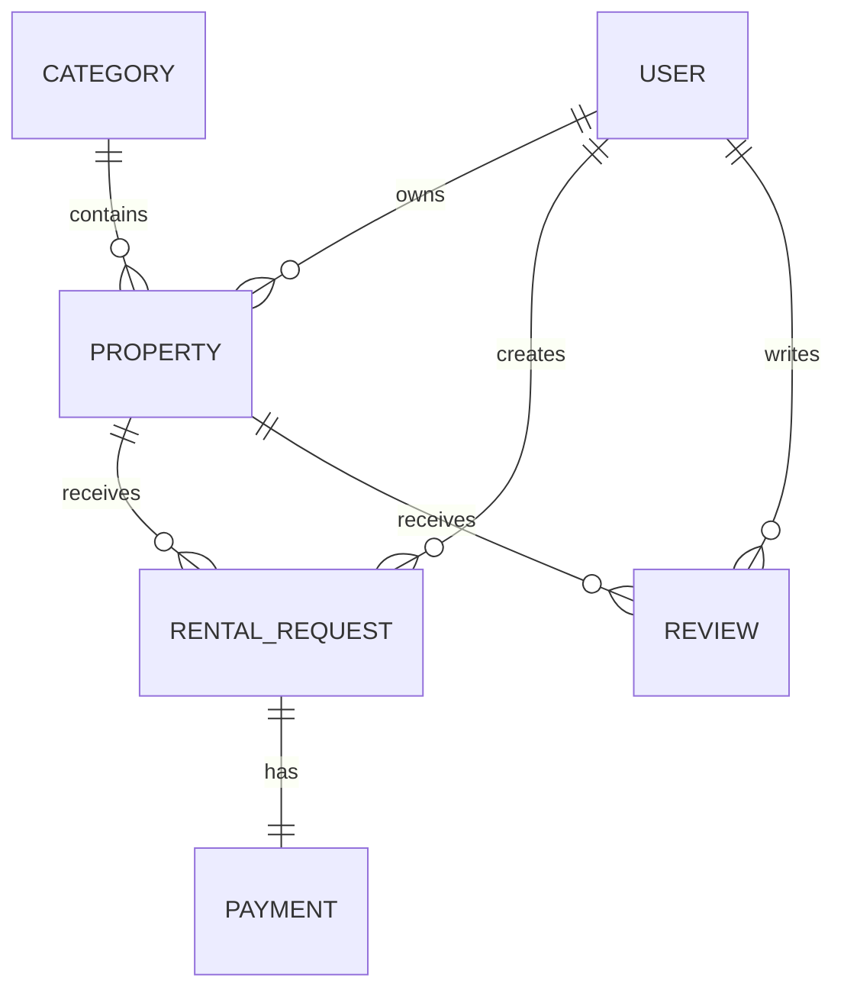
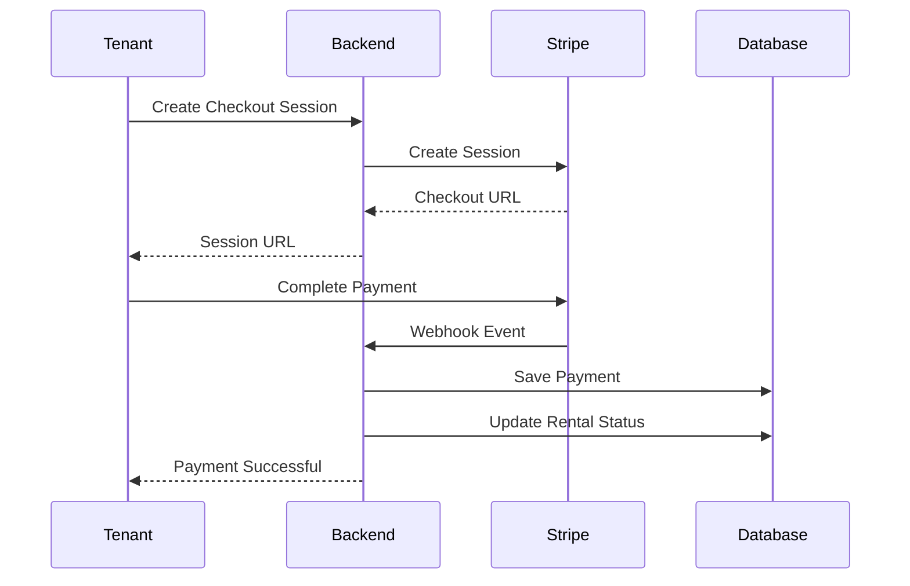
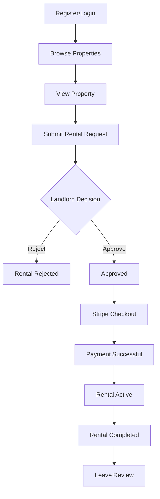
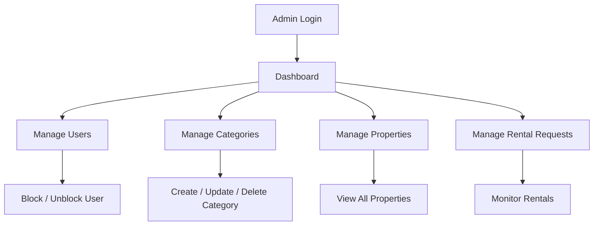

<div align="center">

# 🏠 RentNest

### Find & List Rental Properties with Ease

A modern, scalable and secure Rental Property Marketplace REST API built with **Node.js**, **Express.js**, **TypeScript**, **Prisma ORM**, **PostgreSQL**, and **Stripe Checkout**.

---


</div>

---
<div align="center">

# 🏠 RentNest

### Find & List Rental Properties with Ease

🚀 **Live API:** https://rentnest-backend-fui8.onrender.com

📮 **Postman Documentation:** https://documenter.getpostman.com/view/51446211/2sBY4LQMJe

## 🔑 Admin Demo Account

| Email | Password |
|--------|----------|
| `admin@gmail.com` | `123456` |

</div>
---

# 📖 Overview

RentNest is a production-ready backend REST API for a rental property marketplace where **Tenants**, **Landlords**, and **Admins** interact through a secure role-based system.

The application enables landlords to publish rental properties, tenants to discover and request rentals, secure online payment through Stripe, and administrators to manage the overall platform.

The project follows a modular architecture using Express.js and Prisma ORM with PostgreSQL to ensure scalability, maintainability, and clean code organization.

---

# ✨ Core Features

## 👤 Authentication

- User Registration
- Secure Login
- JWT Authentication
- Password Hashing
- Current User Profile
- Protected Routes

---

## 🔐 Authorization

- Role Based Access Control
- Tenant Permissions
- Landlord Permissions
- Admin Permissions
- Route Protection Middleware

---

## 🏠 Property Management

- Create Property
- Update Property
- Delete Property
- Get All Properties
- Get Single Property
- Property Availability Management

---

## 📂 Category Management

- Create Category
- Update Category
- Delete Category
- Get Categories

---

## 📝 Rental Request System

- Submit Rental Request
- Approve Rental Request
- Reject Rental Request
- Rental Status Management
- View Rental History

---

## 💳 Stripe Payment

- Stripe Checkout Session
- Secure Payment
- Stripe Webhook
- Payment Verification
- Transaction Recording
- Rental Status Update

---

## ⭐ Review System

- Create Review
- View Reviews
- Property Rating

---

## 👑 Admin Features

- Manage Users
- Manage Categories
- View Properties
- View Rental Requests
- Block / Unblock Users

---

## 🔍 Search & Filtering

- Location Filter
- Price Range Filter
- Category Filter
- Property Type Filter
- Search by Keyword

---

## 📄 Pagination

- Page
- Limit
- Sorting
- Metadata

---

## ✅ Validation

- Zod Schema Validation
- Request Validation Middleware

---

## ⚠️ Error Handling

- Global Error Handler
- Prisma Error Handling
- Validation Error Handling
- Custom App Error
- Standardized Error Response

---

## 🚀 Performance

- Prisma ORM
- Transaction Support
- Modular Architecture
- Type Safety
- Environment Configuration

---

# 🛠 Tech Stack

| Category | Technology |
|------------|------------|
| Runtime | Node.js |
| Framework | Express.js |
| Language | TypeScript |
| ORM | Prisma ORM |
| Database | PostgreSQL |
| Authentication | JWT |
| Password Hashing | bcryptjs |
| Validation | Zod |
| Payment | Stripe |
| Build Tool | tsup |
| Development | tsx |
| Environment | dotenv |
| CORS | cors |
| Cookie Parser | cookie-parser |

---

# 📁 Project Structure

```text
src/
│
├── app.ts
├── server.ts
│
├── config/
│
├── Error/
│
├── lib/
│
├── middleware/
│
├── utils/
│
└── modules/
    ├── auth/
    ├── category/
    ├── payment/
    ├── property/
    ├── rentalRequest/
    ├── reviews/
    └── user_admin/

prisma/
│
├── schema.prisma
├── migrations/

generated/

dist/
```

---

# 📂 Folder Responsibilities

## 📦 src/config

Stores all project configuration files.

Examples:

- Environment Variables
- Prisma Configuration
- Stripe Configuration

---

## 📦 src/modules

Contains every business module of the application.

Each module follows a clean architecture:

```
controller
service
route
validation
interface
```

This separation keeps business logic maintainable.

---

## 🔐 auth

Responsible for

- Register
- Login
- JWT
- Authentication
- Authorization

---

## 🏠 property

Responsible for

- Property CRUD
- Search
- Filtering
- Availability

---

## 📂 category

Responsible for

- Property Categories
- Category CRUD

---

## 📝 rentalRequest

Responsible for

- Rental Requests
- Approval
- Rejection
- Rental Status

---

## 💳 payment

Responsible for

- Stripe Checkout
- Payment Verification
- Webhook
- Payment History

---

## ⭐ reviews

Responsible for

- Property Reviews
- Ratings

---

## 👑 user_admin

Responsible for

- User Management
- Admin Operations

---

## ⚠️ middleware

Contains

- Authentication Middleware
- Authorization Middleware
- Validation Middleware
- Error Middleware

---

## 🛠 utils

Contains reusable helper utilities.

Examples

- JWT Helper
- Async Catch Wrapper
- Response Formatter
- Utility Types

---

## ❌ Error

Contains custom error classes and centralized error handling.

---

# 🗄 Database Design

The project uses **PostgreSQL** with **Prisma ORM**.

The database follows a relational design.

Main entities include:

- 👤 User
- 🏠 Property
- 📂 Category
- 📝 Rental Request
- 💳 Payment
- ⭐ Review

Relationships are managed using Prisma relations and foreign keys.

---

# 🔐 Authentication & Authorization

RentNest uses **JWT (JSON Web Token)** based authentication to secure protected resources.

After a successful login, a JWT Access Token is generated and must be included in every protected request.

```
Authorization: Bearer <access_token>
```

---

## 👥 Supported Roles

| Role | Description |
|------|-------------|
| 👤 Tenant | Browse properties, submit rental requests, make payments, leave reviews |
| 🏠 Landlord | Manage properties and rental requests |
| 👑 Admin | Manage users, categories, properties and rental requests |

---

## 🔒 Authorization Middleware

Every protected route passes through the custom authentication middleware.

```ts
auth(Role.ADMIN)
auth(Role.TENANT)
auth(Role.LANDLORD)

or

auth(Role.ADMIN, Role.LANDLORD)
```

The middleware verifies:

- JWT Token
- User existence
- User status
- Authorized role

Only users with the required role can access protected resources.

---

# ✅ Request Validation

All incoming requests are validated using **Zod** before reaching the controller.

The project uses a reusable middleware:

```ts
validateRequest(schema)
```

Implemented validation includes:

- Authentication
- Login
- Property Creation
- Property Update
- Property Availability
- Category Creation
- Category Update
- Rental Request Creation
- Rental Status Update
- Checkout Session
- User Status Update

Invalid requests return validation errors before any database operation is executed.

---

# 🌐 API Documentation

Base URL

```
/api
```

---

# 🔑 Authentication

| Method | Endpoint | Auth | Role | Description |
|---------|----------|------|------|-------------|
| POST | `/auth/register` | ❌ | Public | Register a new user |
| POST | `/auth/login` | ❌ | Public | Login user |
| GET | `/auth/me` | ✅ | Admin / Landlord / Tenant | Get current authenticated user |

---

# 📂 Categories

| Method | Endpoint | Auth | Role | Description |
|---------|----------|------|------|-------------|
| POST | `/categories` | ✅ | Admin | Create category |
| GET | `/categories` | ❌ | Public | Get all categories |
| PATCH | `/categories/:id` | ✅ | Admin | Update category |
| DELETE | `/categories/:id` | ✅ | Admin | Delete category |

---

# 🏠 Properties

## Public Routes

| Method | Endpoint | Auth | Description |
|---------|----------|------|-------------|
| GET | `/properties` | ❌ | Get all properties |
| GET | `/properties/:id` | ❌ | Get property details |

---

## Landlord Routes

| Method | Endpoint | Auth | Role | Description |
|---------|----------|------|------|-------------|
| POST | `/properties/landlord` | ✅ | Landlord | Create property |
| PATCH | `/properties/:id` | ✅ | Landlord | Update property |
| DELETE | `/properties/:id` | ✅ | Landlord | Delete property |
| PATCH | `/properties/:id/availability` | ✅ | Landlord | Update availability |

---

## Admin Route

| Method | Endpoint | Auth | Role | Description |
|---------|----------|------|------|-------------|
| GET | `/properties/deleted_properties` | ✅ | Admin | View deleted properties |

---

# 📝 Rental Requests

## Tenant

| Method | Endpoint | Auth | Role | Description |
|---------|----------|------|------|-------------|
| POST | `/rentals` | ✅ | Tenant | Submit rental request |
| GET | `/rentals` | ✅ | Tenant | Get my rental requests |
| GET | `/rentals/:id` | ✅ | Admin/Landlord/Tenant | Rental details |

---

## Landlord

| Method | Endpoint | Auth | Role | Description |
|---------|----------|------|------|-------------|
| GET | `/landlord/requests` | ✅ | Landlord | View rental requests |
| PATCH | `/landlord/requests/:id` | ✅ | Landlord | Approve / Reject request |
| PATCH | `/landlord/rentals/:id/complete` | ✅ | Landlord | Mark rental as completed |

---

# 💳 Payments

| Method | Endpoint | Auth | Role | Description |
|---------|----------|------|------|-------------|
| POST | `/payments/create` | ✅ | Tenant | Create Stripe Checkout Session |
| POST | `/payments/webhook` | ❌ | Stripe | Stripe Webhook |
| GET | `/payments` | ✅ | Tenant | Get payment history |
| GET | `/payments/:id` | ✅ | Admin/Landlord/Tenant | Payment details |

---

# ⭐ Reviews

| Method | Endpoint | Auth | Role | Description |
|---------|----------|------|------|-------------|
| POST | `/reviews` | ✅ | Tenant | Create review |
| GET | `/reviews/:id` | ❌ | Public | Get review details |

---

# 👑 Admin

## User Management

| Method | Endpoint | Auth | Role | Description |
|---------|----------|------|------|-------------|
| GET | `/admin/users` | ✅ | Admin | Get all users |
| PATCH | `/admin/users/:id` | ✅ | Admin | Update user status |

---

## Property Management

| Method | Endpoint | Auth | Role | Description |
|---------|----------|------|------|-------------|
| GET | `/admin/properties` | ✅ | Admin | View all properties |

---

## Rental Management

| Method | Endpoint | Auth | Role | Description |
|---------|----------|------|------|-------------|
| GET | `/admin/rentals` | ✅ | Admin | View all rental requests |

---

# 🔍 Query Parameters

The Property module supports filtering and searching.

| Parameter | Description |
|------------|-------------|
| `searchTerm` | Search by keyword |
| `location` | Filter by location |
| `category` | Category filter |
| `type` | Property type |
| `minPrice` | Minimum price |
| `maxPrice` | Maximum price |
| `page` | Current page |
| `limit` | Number of items |
| `sortBy` | Sorting field |
| `sortOrder` | asc / desc |

---

# 📦 Example Request

## Register

```json
{
  "name": "John Doe",
  "email": "john@example.com",
  "password": "********",
  "role": "TENANT"
}
```

---

## Login

```json
{
  "email": "john@example.com",
  "password": "********"
}
```

---

## Create Property

```json
{
  "title": "Luxury Apartment",
  "description": "...",
  "price": 15000,
  "location": "Dhaka",
  "categoryId": "...",
  "type": "Apartment"
}
```

---

## Rental Request

```json
{
  "propertyId": "...",
  "moveInDate": "2026-08-01"
}
```

---

# 🗄 Database Relationship



---

# 💳 Stripe Payment Flow

RentNest uses **Stripe Checkout** for secure online payments.

The payment process follows these steps:

1. Tenant submits a rental request.
2. Landlord approves the request.
3. Tenant creates a Stripe Checkout Session.
4. Stripe redirects the tenant to the hosted payment page.
5. Tenant completes the payment.
6. Stripe sends a Webhook event.
7. Backend verifies the webhook signature.
8. Payment information is stored in the database.
9. Rental request status is updated.
10. Property availability is updated if applicable.

---


## Payment Sequence Diagram



---

# 🏠 Rental Workflow



---

# 👑 Admin Workflow



---

# 🔒 Security Features

The backend follows several security best practices.

✅ Password Hashing using **bcryptjs**

✅ JWT Authentication

✅ Protected Routes

✅ Role Based Authorization

✅ Request Validation

✅ Global Error Handling

✅ Prisma ORM to prevent SQL Injection

✅ Environment Variable Configuration

---

# 🌍 Environment Variables

Create a `.env` file in the project root.

```env
NODE_ENV=development

PORT=5000

DATABASE_URL=

JWT_ACCESS_SECRET=

JWT_ACCESS_EXPIRES_IN=

BCRYPT_SALT_ROUNDS=

STRIPE_SECRET_KEY=

STRIPE_WEBHOOK_SECRET=

CLIENT_URL=
```

> **Never commit your `.env` file to version control.**

---

# ⚙️ Installation

## Clone Repository

```bash
git clone https://github.com/Hayder987/B7A4_RentNest_Prisma_Backend
```

---

## Navigate to Project

```bash
cd RentNest
```

---

## Install Dependencies

```bash
npm install
```

---

## Generate Prisma Client

```bash
npx prisma generate
```

---

## Run Database Migration

```bash
npx prisma migrate deploy
```

For local development:

```bash
npx prisma migrate dev
```

---

## Start Development Server

```bash
npm run dev
```

---

## Build Project

```bash
npm run build
```

---

## Start Production

```bash
npm start
```

---

# 📜 Available Scripts

| Command | Description |
|----------|-------------|
| npm run dev | Start development server |
| npm run build | Build TypeScript project |
| npm start | Run production build |
| npm run prisma:generate | Generate Prisma Client |
| npm run prisma:migrate | Run database migration |
| npm run prisma:studio | Open Prisma Studio |
| npm run stripe:webhook | Listen for Stripe Webhook Events |

---

# 🚀 Deployment (Render)

This project is deployment-ready for **Render**.

### Build Command

```bash
npm install && npm run build
```

### Start Command

```bash
npm start
```

### Required Environment Variables

- DATABASE_URL
- JWT_ACCESS_SECRET
- JWT_ACCESS_EXPIRES_IN
- STRIPE_SECRET_KEY
- STRIPE_WEBHOOK_SECRET
- CLIENT_URL
- PORT

---

# 📦 API Response Format

## ✅ Success Response

```json
{
  "success": true,
  "statusCode": 200,
  "message": "Request successful",
  "data": {}
}
```

---

## ❌ Error Response

```json
{
  "success": false,
  "statusCode": 400,
  "message": "Something went wrong",
  "error": {}
}
```

---

## 🔐 Unauthorized

```json
{
  "success": false,
  "statusCode": 401,
  "message": "Unauthorized Access"
}
```

---

## 🚫 Forbidden

```json
{
  "success": false,
  "statusCode": 403,
  "message": "Forbidden"
}
```

---

## 🔍 Not Found

```json
{
  "success": false,
  "statusCode": 404,
  "message": "Resource not found"
}
```

---

# 📮 Postman Collection

The project includes a Postman Collection for testing all available APIs.

Import the collection into Postman and configure the environment variables before testing.

---

# 🔮 Future Improvements

- Email Verification
- Forgot Password
- Refresh Token Authentication
- Image Upload (Cloudinary)
- Wishlist Feature
- Notification System
- Real-time Chat
- Property Analytics
- Admin Dashboard Charts
- Docker Support
- CI/CD Pipeline
- Unit & Integration Testing

---

# 🤝 Contributing

Contributions are welcome!

1. Fork the repository.
2. Create a new feature branch.
3. Commit your changes.
4. Push the branch.
5. Open a Pull Request.

---

# 👨‍💻 Author

**Name:** Hayder Ali

**GitHub:** https://github.com/Hayder987

**LinkedIn:** *https://www.linkedin.com/in/hayder-ali-bb9175349*

**Email:** *hayderbd4290@gmail.com*

---

# 📄 License

This project is licensed under the **MIT License**.

---

<div align="center">

## ⭐ If you like this project, don't forget to give it a Star!

Made with ❤️ using **TypeScript**, **Express**, **Prisma**, **PostgreSQL**, and **Stripe**.

</div>
